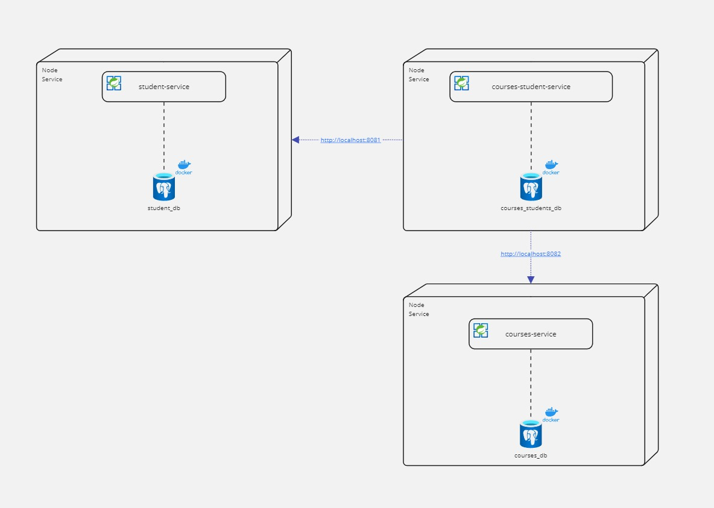

# Microservicios para Student, Course y Course-Student

Este proyecto consiste en una arquitectura de microservicios en Spring Boot. Cada microservicio está destinado a
gestionar información de estudiantes, cursos y la relación entre ellos. Cada uno tiene su propio contenedor Docker y su
propia base de datos PostgreSQL, con pruebas integrales implementadas.

## Configuración y Estructura del Proyecto

cada servicio cuenta con la siguiente estructura:

- **src/main/**
    - **java/org.code. *---nombre del microservicio---* /**
        - **controller**: Controladores de la API REST.
        - **model.*---nombre de la entidad---***: Entidades de la base de datos.
            - **dto**: Objetos de transferencia de datos.
                - ***---nombre de la entidad---* Request.java**: DTO para las solicitudes.
                - ***---nombre de la entidad---* Response.java**: DTO para las respuestas.
            - **mapper**: Mapeadores de entidades a DTO y viceversa.
        - **repository**: Repositorios de la base de datos.
        - **service**: Servicios de la lógica de negocio.
        - ***---nombre del microservicio---* Application.java**: Clase principal de Spring Boot.
    - **resources**
        - **application.yml**: Configuración de la base de datos y el puerto del servidor.
- **src/test/**
    - **java/org.code. *---nombre del microservicio---* /**
        - **models. *---nombre de la entidad---* .mappers. *---nombre de la entidad---* MapperTest**: Pruebas unitarias de los
          mapeadores.
        - **modules.JsonReaderFile**: Clase para leer archivos JSON.
        - ***---nombre del microservicio---* ApplicationTests.java**: Pruebas integrales del microservicio.
    - **resources**
        - ***---nombre de la entidad---* .json**: Datos de prueba en formato JSON.

## Microservicios

1. **Student Service**
    - Endpoint: `http://localhost:8081/students`
    - Base de datos: `student_db`

2. **Course Service**
    - Endpoint: `http://localhost:8082/courses`
    - Base de datos: `courses_db`

3. **Course-Student Service**
    - Endpoint: `http://localhost:8083/courses-students`
    - Base de datos: `courses_student_db`

## Arquitectura

La arquitectura de microservicios se basa en la separación de responsabilidades y la independencia de cada uno de ellos.
Cada microservicio tiene su propia base de datos y se comunica con los demás a través de solicitudes HTTP.



## Requisitos Previos

- **Docker**
- **Java 17+**
- **Maven**

## Configuración y Ejecución

1. **Clonar el Repositorio**
   ```bash
   git clone https://github.com/CowsmonDev/Software-System-Design-TPE.git
   cd Software-System-Design-TPE/Microservices
    ```
2. **Levantar Docker**
   Para levantar docker se debe posicionar en la raiz del proyecto (carpeta Microservices) y ejecutar el siguiente
   comando:
    ```bash
    docker-compose up -d
    ```
3. **Ejecutar Los Microservicios**
   Para ejecutar los microservicios deben ejecutar cada uno de ellos de manera individual ingresando a la carpeta de
   services.
   Dentro de la carpeta del microservicio se encontrara un archivo
   llamado `src/main/java/org.code. *---nombre del microservicio---* / *---nombre del microservicio---* Application.java` el cual se
   debe ejecutar.
4. **Pruebas y Testeo**
    - Cada microservicio cuenta con pruebas integrales que se encuentran en la carpeta `src/test`.
    - Dentro de esas carpetas encontraran un archivo llamado ` *---nombre del microservicio---* AplicationTests.java` el cual
      tendra las pruebas individuales del microservicio.
    - Se podra Ejecutar el archivo completo o probando funcionalidad por funcionalidad.
    - Los datos de prueba se cargan desde archivos JSON para `student_db` y `course_db`.
    - Para `courses_student_db`, se genera aleatoriamente la relación entre estudiantes y cursos basándose en los
      registros
      de los otros dos microservicios.
   